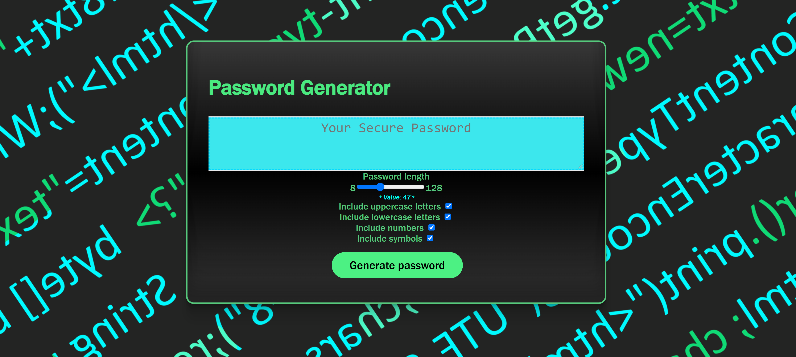
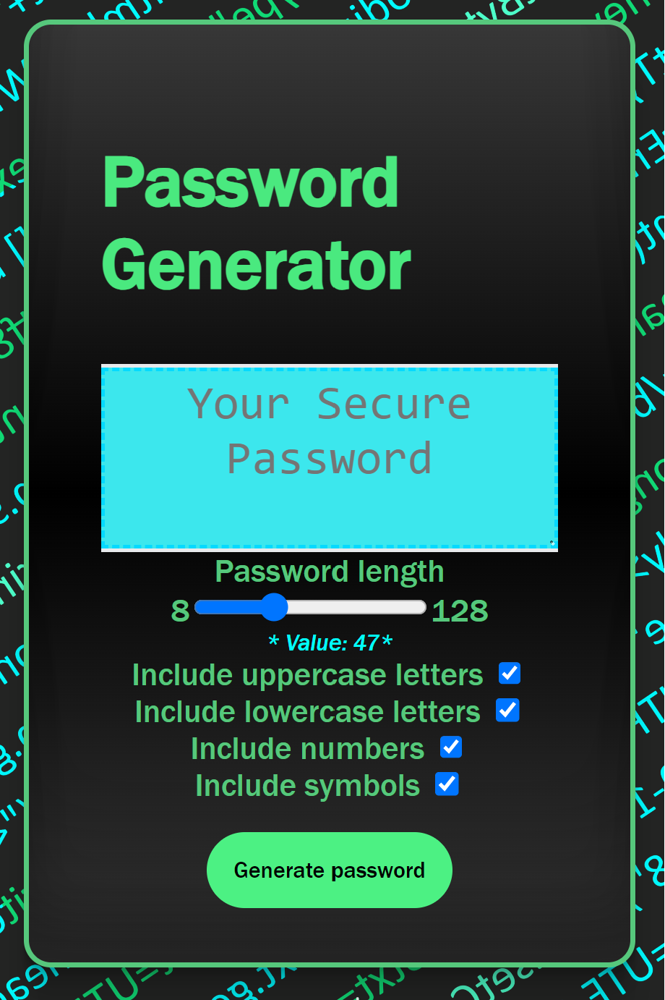

# Password Generator

## Description

A simple app designed to generate a random pass word using JavaScript, For Loops, and Dom Manipulation.

## Table of Contents

1. [Usage](#usage)
1. [Screenshots](#screenshot)
1. [License](#license)
1. [Links](#links)
1. [Questions](#support)

---

## Usage

Visit Deployed Page. Select parameters. Click Generate Password. Copy your new password!

## Screenshots

#### PC View

#### Mobile View

---

## License

[MIT](url)

---

## Links

### [Repo Link](https://github.com/8BitGinger/passwordGenerator)

### [Deployed Link](https://8bitginger.github.io/passwordGenerator/)

---

## Questions

Reach out for Questions or Support here:

### Email:

ryan.fann@gmail.com

#### GitHub Username:

[8BitGinger](https://github.com/8BitGinger)
